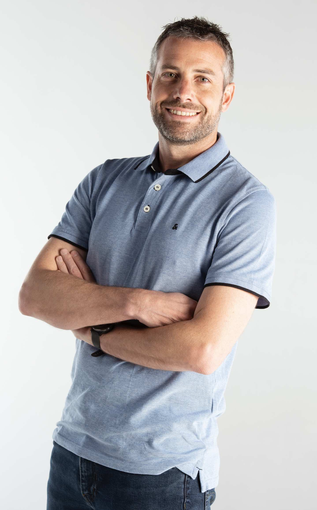

<h3> Biography </h3>

I obtained my Master in Engineering (Computer Science) from UCLouvain in 2005. I then obtained <a href="assets/thesis/2009-schaus.pdf">my Ph.D.</a> in Computer Science from UCLouvain in 2009 under the supervision of Yves Deville, with a dissertation focused on balancing and fairness global constraints in Constraint Programming, as well as on Bin Packing. During my doctoral work, I also had the opportunity to collaborate with Jean-Charles Régin and my colleague Pierre Dupont. 

After completing my Ph.D., I spent five months at Brown University (US), working with Pascal Van Hentenryck on the CP solver of Comet, which Pascal developed jointly with Laurent Michel. I subsequently joined Dynadec, the startup created by Pascal Van Hentenryck to commercialize Comet, where I worked for two years. 

I then spent two years at the UCLouvain spin-off <a href="https://www.n-side.com/">N-SIDE</a>, where I initiated the development of the <a href="https://github.com/pschaus/oscar">OscaR solver</a>, before returning to UCLouvain as faculty in 2012. I continued leading the development of CP solver of OscaR until its retirement, after which it was succeeded by <a href="https://github.com/minicp/minicp">MiniCP</a> and <a href="https://github.com/aia-uclouvain/maxicp">MaxiCP</a>, which I actively maintain. 

In recent years, my research has increasingly focused on decision-diagram-based optimization, a topic pioneered by Willem-Jan van Hoeve and John Hooker team. In collaboration with Cetic, we are now developing <a href="https://github.com/DDOLIB-CETIC-UCL/DDOLib">DDOLib</a>, a solver built around these techniques. I also had a very fruitful collaboration with my former colleague Siegfried Nijssen the past years on algorithms for learning exact or less-greedy decision trees, during which we extended and exploited an idea originally developed by him and Lisa Fromont (DL8 algorithm) involving dynamic programming. 

Over the years, I have also worked on numerous industrial optimization and machine-learning applications (scheduling, routing, configuration, etc.) across a variety of projects. 

I have supervised 15 Ph.D. theses successfully defended. Two former PhD students (<a href="https://hverhaeghe.bitbucket.io">Hélène Verhaeghe</a> and <a href="https://qcappart.github.io">Quentin Cappart</a>) are now my colleagues professors at UCLouvain. I also maintain active research collaborations across the African continent, including <a href="https://ratheil.info" target="_blank">Ratheil Houndji</a> (former PhD student now prof. at UAC, Benin)  and <a href="https://scholar.google.com/citations?user=agmFWy8AAAAJ&hl=fr" target="_blank">Roger Kameugne</a> (prof. at Maroua, Cameroon).

<h3>Research</h3>

Interests
<ul>
   <li> Constraint Programming and Discrete Optimization </li>
   <li> Dynamic Programming, Decision Diagrams, Path-Finding and Anytime Optimization Algorithms </li>
   <li> Data-mining and Machine Learning </li>
   <li> Algorithms and data-structures in general</li>
   <li> Programming languages </li>
</ul>

Current Projects and collaboration
<ul>
   <li> Dynamic Proggramming and MDD Solving, in collaboration with Emma Legrand, Roger Kameugne, and Cetic</li>
   <li> MDD for CP, in collaboration with Amaury Guichard, Hélène Verhaeghe</li>
   <li> VRP in collaboration with Augustin Declecluse</li>
   <li> Networking Optimization and Machine Learning , collaboration with Christel Pelsser and Alice Burlat</li>
   <li> LLM for construction, collaboration with Buildwise and Ioannis Kostis</li>
   <li> AI-based Defect detection for rails, collaboration with PEPPS and Augustin Crespin</li>
   <li> CP MOOC and CP solvers (<a href="www.minicp.org">www.minicp.org</a>, <a href="www.maxicp">www.maxicp.org</a>), in collaboration with Laurent Michel, Pascal Van Hentenryck and Guillaume Derval</li>
</ul>

Past projects
<ul>
   <li> Traffic Engineering, in Software Defined Networks, in collaboration with Olivier Bonaventure (ARC project)</li>
   <li> Scheduling Operations for Steel-Making, in collaboration with PSI Metal (Metal Urbain, Innoviris Bxl)</li>
   <li> Interlocking Systems (verification and optimization), in collaboration with Alstom and Cetic (Inograms project, région Wallonne)</li>
   <li> Energy aware scheduling and planning in Industry, in collaboration with N-SIDE (Industore project, région Wallonne)</li>
   <li> CP-Solver Engineering tools, in collaboration with Michele Lombardi</li>
   <li> Matrix Mining, in collaboration with Vincent Branders and Pierre Dupont</li>
   <li> Bitwise algorithms for Table Constraints and MDD, in collaboration with Christophe Lecoutre</li>
   <li> Vehicule Routing and supply chain optimization, in collaboration with N-SIDE (Presupply project, région Wallonne)</li>
   <li> CP-Based Data-Mining, in collaboration with Tias Guns and Siegfried Nijssen</li>
   <li> <a href="https://uclouvain.be/fr/chercher/fondation-louvain/actualites/creation-de-la-chaire-de-recherche-bpost-en-data-science.html"> B-Post Chair in Data-Science</a>, in collaboration with Siegfried Nijssen (sponsored by B-Post)</li>
   <li> Migration analysis (GLOBMING ARC project), in collaboration with Frédéric Docquier and Siegfried Nijssen</li>
   <li> Learning and Optimization Models in collaboration with PSI Metals, Siegfried Nijssen, Tias Guns, Gael Aglin (Reconcile Innoviris Project Bxl)</li>
   <li> Intelligent Planning with Traxeo  (Deep Construct Walloon Region project)</li>
   <li> Scheduling the unmounting of plances , (Planum Project, région Walllonne)</li>
</ul>